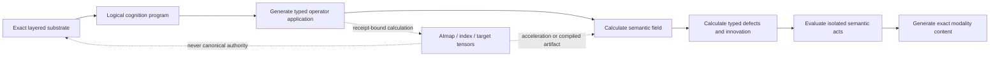

# Native cognition mathematics

## Status and purpose

This document formalizes the current mathematical boundary of Laplace. It separates
invariants already established by the invention from candidate mathematics that must
still be derived, implemented, falsified, and measured. A familiar equation or
numerical method is not evidence that the resulting Laplace operator is correct.

Laplace requires two native mappings:

\[
\boxed{
  (\text{exact layered substrate},\ \text{context},\ \text{goal})
  \xrightarrow{\mathscr C}
  \text{semantic state and selected act}
}
\]

and, for each output modality \(m\),

\[
\boxed{
  \text{semantic state and selected act}
  \xrightarrow{\mathscr R_m}
  \text{exact content composition}
}
\]

\(\mathscr C\) is the native cognition contract. \(\mathscr R_m\) is a typed
realization contract. Neither mapping is autoregressive next-token continuation.

## 1. The operator is calculated from the layered substrate

At a declared evidence boundary and time, the relevant state is

\[
\mathcal S_t=(\mathcal E,\mathcal P,\mathcal O,\mathcal A,\mathcal C,\mathcal I)_t,
\]

where the components are canonical entities, calculated physicalities, occurrences,
attestations, consensus epochs, and derived claims. These components are never
flattened into one undifferentiated node or edge table.

The physicality trajectory is already a bit-perfect Merkle-DAG realization from
container trunk to codepoint leaf. It therefore calculates structural facts without
asking a source to assert them. At a pinned physicality recipe and geometry epoch, the
engine can derive at least:

- container and constituent identity;
- constituent role, ordinal, multiplicity, and run boundaries;
- `contains`, `constituent-of`, `precedes`, `follows`, ancestor, and descendant;
- exact tier path, dimensions, shape, trajectory, centroid, radius, and locality data;
- exact repeated occurrences of a constituent within the realization.

These are not attestations and do not pass through source trust or consensus before
they can be used. They are calculated consequences of exact content and physicality,
bound to the recipe and epoch by a calculation receipt. An occurrence then records
that the realization appeared in a particular source/context. Attestations add
attributable claims about the entity, physicality, occurrence, relation, type,
interpretation, or meaning. Consensus adjudicates eligible claims; inference derives
new claims. None of those upper layers instantiate or rewrite the underlying
structural facts.

This applies uniformly to text, model, image, audio, video, code, chess, and every
other modality. A text container directly supplies exact codepoint and higher
composition order. A model container directly supplies exact tensor cells, axes,
shape, byte order, and containment. What a tensor computes, what a phrase means, or
which source claim should be believed can require testimony or inference; its exact
realized structure does not.

Laplace does not persist a universal graph and then treat that graph as the invention.
For a specific cognition program, the ISA resolves the required exact content,
physicalities, occurrences, testimony, source boundary, relation laws, time, context,
and goal. It then **calculates and generates** the typed operator application required
by that program. A sparse graph, incidence block, matrix, spectral basis, kernel, or
target tensor is a generated view or artifact with a receipt. It is not canonical
substrate authority.

A generated field can attach different value spaces to different objects. An entity field, a
physicality field, a proposition field, a discourse-reference field, and a relation
role need not have the same dimension or units. Typed relations provide restriction,
transport, or incidence maps between their fields. Ordered and n-ary compositions
retain their roles, ordinals, container identity, and provenance instead of being
silently expanded into anonymous pairwise similarity edges. Operator application can
walk and calculate directly over those typed structures without first publishing a
flattened graph.

For structural or semantic relation family \(r\), let

\[
\delta_{r,t}:C^k_{r,t}\rightarrow C^{k+1}_{r,t}
\]

be the typed compatibility or incidence operator declared by the relation algebra.
It preserves direction, converse law, sign, arity, time, context, and the relation's
legal compositions. Ordinary graph incidence is one special case.

For a typed calculated or attested relation occurrence \(r:i\rightarrow j\) with
transport law \(T_r\), a
primitive generated compatibility term can be

\[
(\delta x)_r=x_j-T_rx_i.
\]

The transport law and the source/target fields are relation-type contracts. `is-a`,
`precedes`, `contains`, `translation`, `causes`, and a semantic role never become the
same law merely because each has two addressable endpoints. An n-ary composition uses
an n-ary incidence cell over its constituent roles and container; it is not replaced
by anonymous pairwise edges.

## 2. Constraint metrics preserve structural certainty and epistemic uncertainty

Let \(G_{r,t}\) be the declared metric or precision over the generated
relation-defect space for relation family \(r\). Its source depends on the layer that
generated the relation.

For exact content and physicality laws, structure is enforced directly in the
admissible space or by an exact structural metric derived from the physicality recipe.
It is not represented by an arbitrary giant confidence number and is not weakened by
source popularity. A corrupted ordinal, run, child identity, or trajectory is a failed
structural calculation, not low-confidence testimony.

For attested or uncertain relations, \(G_{r,t}^{\mathrm{epistemic}}\) is calculated at
an immutable consensus epoch from eligible testimony and retains:

- independent root observations and their dependence graph;
- copied and derived ancestry;
- support, contradiction, uncertainty, and unknown state;
- witness, source, source-type, relation, model, and context trust dimensions;
- valid time, observation time, world, and source boundary;
- the exact adjudication program and receipt.

Ten descendants of one root do not produce the metric of ten independent roots.
Changing the epistemic metric publishes a new epoch; it does not mutate testimony,
identity, physicality, or exact structural relations. \(G_{r,t}\) can be
matrix-valued when independent components of a typed relation have different exact
units, supported precision, or covariance. Positive semidefiniteness, units, rank,
layer source, and uncertainty behavior are explicit contracts.

For the self-adjoint energy and spectral contract, \(G_{r,t}\) is a positive
semidefinite precision/metric. Contradictory testimony is represented as competing
typed witnessed constraints with its own provenance and uncertainty; it is not encoded
by making evidence precision negative. Signed, directional, or irreversible operators
use a separately declared signed construction, non-self-adjoint generator, or coupled
spaces. They cannot be passed to a symmetric eigensolver merely because their storage
has a matrix shape.

The first operator family to investigate is generated from typed incidence and its
layer-correct metric:

\[
\mathscr L_{r,t}=\delta_{r,t}^{\!*}G_{r,t}\delta_{r,t}.
\]

The adjoint is taken under the declared domain and codomain measures. A block or
higher-degree application is generated from typed relation spaces and legal cross-type
maps for the current program. This construction is preferred to an unexplained scalar mixture such as
\(\sum_r\alpha_rL_r\). If cross-type scaling is necessary, its units and value must be
derived from a declared measurement, evidence, or optimization contract and retained
in the receipt.

### 2.1 Path transport and closure are research obligations

When relation transports are composable along a typed path

\[
  i_0 \xrightarrow{r_1} i_1 \xrightarrow{r_2}\cdots
  \xrightarrow{r_n} i_n,
\]

the generated path transport is

\[
  T_\pi=T_{r_n}\cdots T_{r_2}T_{r_1}.
\]

For a closed path, the difference between that composition and the closure law declared
for the path is a candidate path-dependent defect. An identity closure law gives the
special comparison \(T_\pi-I\); a logarithm, commutator, or other coordinate is valid
only when its domain and branch conditions are declared and certified.

Nonidentity closure is not automatically contradiction. Directed processes,
noncommuting relation families, gauge choice, and genuine curvature can make path
dependence lawful. The research gate is therefore to determine, for each typed relation
family, the expected closure object, its invariances, the admissible defect measure,
and whether the result predicts held-out structure. This makes semantic holonomy and
curvature falsifiable candidates rather than names assigned to arbitrary loop error.

A self-adjoint positive semidefinite operator supports energy minimization and spectral
analysis. Directional, causal, irreversible, or signed execution can require a
non-self-adjoint generator, coupled primal/dual operators, or separated symmetric and
skew components. The ISA therefore represents an operator family; it does not force
every relation into \(D-W\).

### 2.1 Neighbor is a generated query relation

Laplace has no universal stored meaning of `neighbor`. For a query program \(q\), a
candidate pair can expose a typed observation vector such as

\[
N_q(i,j)=\bigl(
N_{\mathrm{structure}},
N_{\mathrm{tier}},
N_{\mathrm{containment}},
N_{\mathrm{ordinal}},
N_{\mathrm{occurrence}},
D_{\mathrm{angular}},
D_{\mathrm{Fr\acute echet}},
D_{\mathrm{Hausdorff}},
K_{\mathrm{Karcher}},
R_{\mathrm{Glicko2}},
T_{\mathrm{source}},
T_{\mathrm{source\ type}},
I_{\mathrm{relation}}(q),
\ldots
\bigr).
\]

The structural components are calculated from physicality trajectories and occurrence
scope. Geometry components are calculated by their own typed point, curve, set, or
manifold contracts. Glicko-2 standing and trust components come from the eligible
epistemic epoch. Relation importance is conditioned by the goal, context, relation
law, tier, containment scope, and requested result. A noun is not permanently more
important than a function word; the current program determines which relations and
roles answer its question.

The query can produce a scalar rank, partial order, Pareto set, path cost, or typed
neighborhood, but only through a declared function

\[
\operatorname{rank}_q(i,j)=F_q(N_q(i,j),g,\Gamma,t).
\]

Every selected component, normalization, comparison, and tie rule is receipted. The
calculated rank is a result of \(q\); it is not written back as identity, physicality,
testimony, universal adjacency, or timeless importance. Angular, Fr\'echet, Hausdorff,
Karcher-derived, Hilbert-locality, containment, precedence, semantic, and
operator-induced neighbors remain distinguishable and can disagree without corrupting
one another.

## 3. A prompt compiles into a logical cognition program

An utterance is first exact content. Its calculated physicality structure, observed
occurrences, eligible testimony, and active discourse state compile into a typed
logical program

\[
q_t=(g,\Gamma,B,b,\Omega,\mathcal W,\tau,\Pi),
\]

containing at least:

- goal and success condition \(g\);
- context, world, valid time, evidence epoch, and source boundary \(\Gamma\);
- mentioned entities, propositions, references, and boundary constraints \(B\);
- injected observations, requested unknowns, or source terms \(b\);
- permitted relation laws and operator spaces \(\Omega\);
- active working/discourse state \(\mathcal W\);
- required evidence and uncertainty contract \(\tau\);
- requested result structure and modality contract \(\Pi\).

The string is not the cognition plan, just as SQL text is not a physical database plan.
The native planner lowers the logical program into generated sparse operator applications,
indexed traversals, exact relation-algebra steps, perfcache reads, hypothesis tests,
counterfactual evaluations, and realization work. Its cost model uses measured
cardinality, selectivity, storage, memory, evidence, and kernel statistics.

For goal-directed retrieval and inference, the logical program also declares a typed
state-search contract

\[
\mathcal Q_{\mathrm{search}}=(S_0,\mathcal T_q,G_q,c_q,h_q,\chi_q,\prec_q),
\]

where \(S_0\) is the initial state set, \(\mathcal T_q\) is the enabled family of typed
transitions, \(G_q\) is the terminal predicate, \(c_q\) is transition cost, \(h_q\) is
the declared remaining-cost estimate, \(\chi_q\) contains hard context/evidence/time
constraints, and \(\prec_q\) defines deterministic tie and duplicate-state rules.
Physicality, trajectory, containment, ordinal, relation, occurrence, source, standing,
and geometric indexes generate bounded frontier batches; they do not decide the goal.

For A-star search, a partial state \(s\) is ordered by

\[
f_q(s)=g_q(s)+h_q(s).
\]

An exact optimality claim requires a nonnegative cost contract, a proven admissible
heuristic, consistency or explicit reopen semantics, a canonical state identity, and
deterministic tie rules. If those conditions do not hold, the engine records the
actual best-first or bounded-search semantics and cannot claim A-star optimality. The
receipt retains every indexed expansion family, pruned state, cost component,
heuristic component, evidence epoch, and completion proof.

A metric top-\(k\) operation can generate one frontier batch—such as nearest realized
curves under Fréchet distance—but it cannot define cognition-wide relevance. The
search program can combine exact structural transitions, geometric candidates,
attested semantic relations, Glicko-2 standing, trust, contradiction, and discourse
constraints without publishing their query-specific cost as a substrate fact.

Generation is query- and state-specific. The planner must not create every possible
pairwise edge, co-occurrence, relation composition, or coordinate merely because it can
be derived. It calculates the required values in bulk, retains the canonical inputs and
receipt, and publishes a reusable artifact only under an explicit materialization or
perfcache contract.

## 4. Field solution and compatibility energy

A useful general form is a constrained variational problem:

\[
\phi_t^*=\arg\min_{\phi}
\left[
\frac12\|\delta_t\phi-\omega_t\|_{G_t}^2
+\frac12\|B_t\phi-g_t\|_{R_t}^2
+\frac12\|\phi-\phi_{0,t}\|_{M_t}^2
\right].
\]

Here \(\omega_t\) can encode witnessed typed relation targets, \(B_t\phi=g_t\) encodes
hard or measured boundary state, and \(\phi_{0,t}\) carries explicit prior working
state. The corresponding normal equation is

\[
(\delta_t^{\!*}G_t\delta_t+B_t^{\!*}R_tB_t+M_t)\phi
=\delta_t^{\!*}G_t\omega_t+B_t^{\!*}R_tg_t+M_t\phi_{0,t}.
\]

The familiar regularized Poisson form

\[
(\mathscr L_t+\lambda I)\phi_t=b_t
\]

is a useful special case, not yet the complete cognition equation. Dirichlet,
Neumann/source, null-space, conservation, and temporal initial conditions must be
explicit. A solver cannot silently choose them.

The solution is a typed semantic field over the selected substrate boundary. It can
rank relevance, expose compatible explanatory paths, bind references, propagate a
constraint, or provide a coordinate basis. It is not itself a conversational answer.

## 5. Frayed structure is not the linear-solver residual

If \((\mathscr L+\lambda I)\phi=b\) is solved exactly, then

\[
b-(\mathscr L+\lambda I)\phi=0
\]

and \(b-\mathscr L\phi=\lambda\phi\). Calling either quantity a frayed edge would make
the feature mathematically wrong.

Laplace instead calculates separately typed defect observables:

\[
d_{\mathrm{relation}}=\delta_t\phi_t-\omega_t,
\]

\[
d_{\mathrm{boundary}}=B_t\phi_t-g_t,
\]

plus relation-law defects, independently supported testimony conflicts, motif
completion defects, prediction innovations, and counterfactual energy changes.

A frayed-edge hypothesis requires all of the following:

1. a recurring typed motif or declared relation law predicts a missing or conflicting
   role;
2. the localized defect is reproducible under a pinned source boundary and epoch;
3. the candidate closes the expected structure or explains the innovation;
4. counterexample search does not already refute it;
5. its result remains a hypothesis or derived attestation with complete root lineage.

High field magnitude, geometric proximity, solver non-convergence, or missing storage
alone does not establish a frayed edge.

### 5.1 Existing and missing structure use different comparisons

For an existing calculated structural relation or eligible attested relation, the
local compatibility energy is

\[
\epsilon_r=(\delta\phi)_r^{\!*}G_r(\delta\phi)_r.
\]

A large value identifies an evidenced relation-law incompatibility under the current
semantic state. Its type remains attached to the defect.

For a missing candidate relation \(e\), simply adding a nonnegative energy term cannot
be credited as reducing the same fitted objective. If

\[
J_{\mathcal S\oplus e}(\phi)=J_{\mathcal S}(\phi)+J_e(\phi),\qquad J_e\ge0,
\]

then \(\min J_{\mathcal S\oplus e}\ge\min J_{\mathcal S}\). Candidate value is instead
measured on a fixed evaluation boundary that the candidate did not generate:

\[
\Delta_e=
J_{\mathrm{eval}}(\phi_{\mathcal S}^{*})
-J_{\mathrm{eval}}(\phi_{\mathcal S\oplus e}^{*})
-\operatorname{Complexity}(e).
\]

Generation, fitting, evaluation, and counterexample evidence boundaries are disjoint
where the experiment requires them and are content-addressed in the receipt. A positive
\(\Delta_e\) means the candidate improves prediction or compatibility on unchanged
evidence after its complexity cost. It proposes a hypothesis; it does not witness the
relation or contribute an independent root observation.

### 5.2 Innovation is an epistemic observation

For newly observed testimony \(z_t\), a pinned cognition program can generate a
prediction \(\widehat z_t\) from the prior source boundary. The typed innovation

\[
\nu_t=z_t-\widehat z_t
\]

retains the predicted value, observed value, source, context, relation laws, evidence
epoch, calculation program, and uncertainty metric. Large innovation can trigger motif
search or a candidate relation experiment, but it cannot be converted directly into a
fact.

### 5.3 Gödel discovery proposes extensions to the current calculus

Let \(F_t\) be a persistent set of typed frays under current calculus version
\(\Theta_t\). The Gödel engine generates candidate extensions

\[
h\in\mathcal H=\{
\text{entity},\text{physicality},\text{relation},\text{relation family},
\text{motif},\text{law},\text{operator},\text{firmware operation},
\text{cognition program}
\}.
\]

Each \(h\) declares the vacancy signature it is intended to occupy, the current
calculus it extends, its generated predictions, fitting boundary, unchanged evaluation
boundary, counterexample search, experiment program, complexity, and expected
observable consequences. A general candidate score has the form

\[
V(h)=J_{\mathrm{eval}}(\Theta_t)
-J_{\mathrm{eval}}(\Theta_t\oplus h)
-C(h),
\]

with evaluation evidence unavailable to generation and fitting where the experiment
requires separation. A candidate that survives this comparison remains a derived
hypothesis. It does not occupy the predicted slot as witnessed reality.

The same loop can generate a candidate refutation. A typed contradiction, failed
prediction, or counterexample first produces a derived negative claim naming the
proposition, defect, source boundary, and test that generated it. Executing the test
through the OODA boundary preserves its epistemic layer: an attributable external
observation is a witnessed negative attestation; a deterministic program produces
calculated contradiction evidence with exact inputs and a calculation receipt; a
chained conclusion remains a derived refutation hypothesis. The calculated result can
support and be independently reproduced by a refutation program, but it never becomes
a witness. Only eligible independent observations add independent witness roots.
Adjudication can therefore lower or refute a proposition without deleting it or
allowing the Gödel engine's own candidate to certify itself.

If new independent observation and complete experiment acceptance support activation,
the result is a new content-addressed calculus version

\[
\Theta_t\xrightarrow{h,\;receipt}\Theta_{t+1}.
\]

Earlier programs and results remain replayable under \(\Theta_t\). The extension
receipt identifies every new or changed type, law, operator, proof obligation,
counterexample boundary, result, and dependent firmware or perfcache artifact. No
calculus version asserts final completeness.

## 6. Selection evaluates acts through isolated state changes

Answering, asking a question, correcting a premise, calculating, searching, executing,
and returning unknown are typed candidate acts. Each act \(a\) is evaluated against an
isolated predicted state \(\mathcal S_{t+1}^{(a)}\), never by mutating canonical state
during planning.

The valuation contract records, without collapsing them into one unexplained score:

- satisfaction of the goal and output contract;
- reduction of the relevant typed defects;
- evidence sufficiency and contradiction exposure;
- expected information gain;
- compute, latency, storage, and external-effect cost;
- firmware ordering and exact tie rules;
- execution authority and effect-envelope validity.

Hard validity and evidence constraints are applied before deterministic comparison.
The selected act and every rejected candidate retain a decision receipt sufficient to
replay the divergence.

### 6.1 OODA closes effects back into universal observation

The operational cycle is

\[
\mathcal S_t
\xrightarrow{\mathrm{observe}} z_t
\xrightarrow{\mathrm{orient}} (q_t,\mathscr L_t,\phi_t,\mathscr F_t)
\xrightarrow{\mathrm{decide}} a_t
\xrightarrow{\mathrm{act}} e_t
\xrightarrow{\mathrm{observe}} z_{t+1}
\rightarrow\mathcal S_{t+1}.
\]

Observe distinguishes exact calculated structure from claims and records source,
context, and outcome. Orient generates the appropriate typed measurements, indexed
search, operator, field, and defect state for the goal. Decide evaluates isolated
semantic acts, hypotheses, tests, and experiments. Act performs modality realization
or an authorized external effect. The resulting world observation re-enters through
the same content, physicality, occurrence, testimony, and receipt layers.

Fast cognition can complete without changing standing or calculus. Learning can
publish a new evidence epoch without changing relation laws. Gödel discovery can
propose a new calculus but cannot activate it merely because it generated it. These
three transitions have different state types and receipts.

## 7. AImap is a derived operator coordinate system

S3 physicality and high-dimensional operator coordinates describe different
properties of the same entity:

\[
e_i\mapsto p_i\in S^3
\quad\text{and}\quad
e_i\mapsto y_i\in\mathbb R^d.
\]

The physical coordinate is a calculated realization under the Unicode/DUCET and
composition geometry contract. The **AImap** coordinate is a derived spectral view of
a pinned typed operator generated from exact structure and the eligible epistemic
layers selected by its program. It is not identity, physicality, testimony, or belief.

For a self-adjoint operator with mass/measure matrix \(M_t\), solve

\[
\mathscr L_t\Phi_t=M_t\Phi_t\Lambda_t,
\qquad
\Phi_t^{\!*}M_t\Phi_t=I,
\]

remove the declared null modes, and retain the required nontrivial eigenspaces. Row
\(i\) of \(\Phi_t\) supplies the operator coordinates of object \(i\). This is a
spectral lift from a finite canonical substrate into global exact-structure and
eligible epistemic relation modes,
not a projection of four coordinate values into \(d\) dimensions.

The AImap is a typed modular perfcache with a receipt naming:

- operator, relation laws, evidence and physicality epochs, and source boundary;
- domain objects, ordering, measures, null-space contract, and requested eigenspaces;
- solver, precision, tolerances, convergence residuals, and orthogonality defects;
- anchor set and alignment transform;
- artifact identity, publication epoch, and canonical-parity probes.

The canonical engine must be able to generate and apply the operator matrix-free from source state.
The AImap accelerates declared operations and supplies model-compilation coordinates;
it cannot become the only surviving statement of substrate semantics.

## 8. Lanczos, orthogonalization, SVD, and Procrustes have distinct roles

For a large sparse self-adjoint problem, restarted block Lanczos or another declared
sparse eigensolver calculates only the required eigenspaces through operator-vector
products. Reorthogonalization controls finite-precision loss of Krylov-basis
orthogonality. Gram-Schmidt is therefore numerical machinery inside the eigensolver,
or a tool for combining declared basis families; it is not a semantic stage applied to
entity rows.

Eigenvector sign is arbitrary, and a repeated or clustered eigenvalue identifies an
eigenspace rather than a unique basis. Semantic comparison therefore uses eigenvalues,
residuals, principal angles, and subspace projectors. It never treats raw eigenvector
orientation as meaning.

When stable coordinates are required across epochs or against a target space, anchor
objects define an orthogonal Procrustes problem:

\[
R^*=\arg\min_{R^{\!*}R=I}\|\Phi_{A,t}R-Z_A\|_F^2.
\]

SVD of the anchor cross-covariance produces the rigid alignment. The rotation preserves
internal distances and receives its own receipt. SVD here aligns coordinate frames; it
is distinct from SVD used to factor a relation operator into target-model matrices.

## 9. Epoch updates must be incremental and independently reconciled

New entities and evidence change \(\mathscr L_t\) and its eigenspaces. The engine shall
support sparse incremental/operator-epoch updates, warm-started block solves, stable
anchor alignment, and localized coordinate publication. Every published update proves:

- operator and source-boundary reconciliation;
- eigenpair residual and orthogonality bounds;
- subspace drift and anchor error;
- unchanged-region stability under the declared perturbation bound;
- agreement with scheduled full recomputation probes;
- coherent publication without mixed coordinates from two epochs.

A change too large for the incremental error contract triggers a new complete spectral
epoch calculation before publication. No query can observe a partially updated AImap.

## 10. Relation operators and model compilation

Let \(X=\Phi_t\) or another declared substrate coordinate basis. A typed witnessed
relation target \(S_r(i,j)\) and epistemic sample metric define an operator fit:

\[
M_r^*=\arg\min_M
\sum_{(i,j)\in\Omega_r}
g_{ij}\bigl(x_i^{\!*}Mx_j-S_r(i,j)\bigr)^2
+\mathcal R_r(M).
\]

Training, validation, withheld-evidence, contradiction, and dependence boundaries are
content-addressed. A low-rank factorization

\[
M_r\approx W_QW_K^{\!*}
\]

can realize that relation as a target attention operator. Contextual transformation
targets similarly define value/output operators. Head-specific operators retain their
relation and probe contracts.

If coordinates rotate as \(X'=XR\), the compensated operator is

\[
M'_r=R^{-1}M_rR^{-*},
\]

which reduces to \(R^{\!*}M_rR\) for orthogonal \(R\). Model comparison and acceptance
therefore operate on induced functions and probe behavior, not raw coordinates or
factor bytes.

The demonstrated direct GGUF construction remains the baseline existence proof:
substrate testimony was compiled into an identity embedding and attestation/log-odds
output matrix, then executed by an external runtime. Spectral embeddings and complete
Q/K/V/O construction extend that proof; they do not rewrite what it demonstrated.

## 11. Semantic plan and modality realization

The selected act becomes a semantic realization plan containing propositions,
relations, discourse role, ordering constraints, evidence boundaries, requested
precision, language or modality, and exact completion condition.

For modality \(m\), the realizer solves a constrained construction problem over
Laplace content:

\[
Y_m^*=\arg\min_{Y\in\mathcal Y_m}
\mathcal E_m(Y;\ \text{semantic plan},\mathcal S_t),
\]

subject to exact structural validity, evidence closure, non-contradiction, and output
contract constraints. Language uses witnessed morphology, syntax, roles, pragmatics,
precedence, and real sentence compositions. Image, audio, video, code, model, and other
modalities use their typed structural operators while retaining the same identity,
testimony, selection, and receipt laws.

The output receipt distinguishes reused witnessed composition, newly constructed
composition, deterministic calculation, and unsupported content. Realization does not
invent evidence.

## 12. Falsification program

The native cognition mathematics is accepted only when implementation tests prove:

1. standard graph Dirichlet and Poisson fixtures reduce to independently calculated
   known solutions;
2. direction, sign, unequal field dimension, n-ary role, temporal scope, and evidence
   dependence change the operator exactly where their contracts require;
3. copying one root observation many times does not change effective conductance as
   though independent evidence arrived;
4. a solved linear system has zero solver residual while deliberate missing motif,
   relation-law, boundary, and contradiction fixtures produce only their respective
   typed defects;
5. removing the mechanism responsible for a result makes that result test fail;
6. matrix-free and materialized operator applications agree;
7. AImap eigenpairs satisfy residual, orthogonality, null-space, and independent
   eigensolver checks;
8. sign flips and rotations inside a repeated eigenspace preserve semantic equivalence,
   while an uncompensated operator rotation fails;
9. incremental and complete spectral epochs agree within declared bounds and publish
   coherently;
10. the same semantic plan is realized in multiple languages and modalities without
    passing through an English token plan;
11. every selected proposition and emitted constituent closes to eligible testimony or
    a reproducible calculation receipt;
12. identical state, context, goal, firmware, program, and tie rules reproduce the same
    act and receipt.
13. indexed A-star matches an independently solved typed-state fixture and loses its
    optimality claim when the heuristic, reopen, or tie contract is deliberately
    violated;
14. metric top-k candidates that violate the complete goal are rejected or expanded
    rather than returned as cognition results;
15. structural, geometric, semantic, and epistemic neighborhood fixtures with
    deliberately disagreeing orderings cannot be reproduced by one scalar affinity.
16. a constrained vacancy predicts a held-out occupant signature while an empty query
    without surrounding law does not trigger discovery;
17. candidate entities, relation families, laws, operators, firmware operations, and
    cognition programs remain derived until independent observation supports them;
18. fast cognition, evidence-epoch learning, and calculus-version activation cannot
    alter one another's state under deliberate transition-substitution defects;
19. Observe, Orient, Decide, Act, and consequence observation replay as separate typed
    stages, and self-generated descendants contribute no independent support.

Candidate-relation experiments additionally prove that training improvement alone does
not establish a missing edge. A candidate that merely adds degrees of freedom but does
not improve the pinned evaluation boundary is rejected. Deliberately leaking evaluation
testimony into generation or fitting must make the experiment fail.

## 13. The generated intelligence object

Laplace does not replace one transformer with another permanent model. At a pinned
state and cognition program it generates and executes the required members of

\[
\boxed{
(\mathcal S,\mathscr L,\mathscr F,\mathscr C,\mathscr R)
}
\]

where \(\mathcal S\) is the exact layered substrate, \(\mathscr L\) is the
layer-metrized typed compatibility operator, \(\mathscr F\) is the typed defect and
innovation calculus, \(\mathscr C\) is deterministic counterfactual act selection, and
\(\mathscr R_m\) constructs exact content in modality \(m\).

An AImap, embedding table, attention head, reranker, GGUF tensor set, query index, or
language plan is generated from this machinery under a declared program and receipt.
It cannot replace \(\mathcal S\) or become a second private semantic authority.

## 14. Research boundary

Existing work establishes useful neighboring calculations, not Laplace's complete operator:

- graph harmonic extension formulates label propagation as a Dirichlet-energy problem,
  while also exposing the failure of assuming every observed edge means similarity;
- sheaf Laplacians support non-constant, asymmetric, signed, and varying-dimensional
  relations;
- sheaf hypergraph and symmetric-simplicial-set work supports higher-order relations,
  orientation, and preservation of hyperedge provenance;
- Laplacian Eigenmaps supplies spectral coordinates from a graph operator;
- Lanczos, reorthogonalization, Procrustes, and SVD supply established numerical tools.

Laplace still has to derive and prove the calculation and generation contract induced by exact content
identity, recursive physicality, ordered composition, occurrence, provenance-dependent
testimony, immutable epistemic epochs, typed relation algebra, goals, acts, and exact
multimodal realization. Novelty is a separate evidence question and is not asserted by
this specification.

### 14.1 Open derivation obligations

Implementation cannot proceed by silently choosing these values. The formal research
and fixture program must derive and record:

1. the field/fiber carried by each entity, physicality, occurrence, proposition,
   relation role, context, and working-state object;
2. the transport/incidence law of every primitive relation and n-ary composition and
   the legal generated composition of those laws;
3. the conversion from root-aware testimony, uncertainty, dependence, trust, and
   contradiction into a dimensioned evidence metric or competing constraint family;
4. the mass/base measure and the exact role of S3 physicality, cardinality,
   multiplicity, occurrence, and context in each generated problem;
5. the boundary, source, initial-state, null-space, conservation, and termination
   semantics compiled from each cognition act;
6. when the generated operator is self-adjoint, signed, directed, nonlinear,
   time-dependent, or coupled, and which certified solver applies;
7. the stable domain decomposition, sparse application, incremental update, and
   perfcache publication mathematics at product scale;
8. the independent fixtures and deliberate defects that distinguish a correct operator
   from a plausible result shape.

No coefficient, transport, metric, field dimension, null-space treatment, anchor set,
or tolerance earns product status solely because it produces fluent conversation.

Primary references used to establish this boundary:

- [Learning Label Initialization for Time-Dependent Harmonic Extension](https://www.ijcai.org/proceedings/2022/387)
- [Sheaf Neural Networks](https://arxiv.org/abs/2012.06333)
- [Sheaf Hypergraph Networks](https://arxiv.org/abs/2309.17116)
- [Hypergraph Neural Sheaf Diffusion](https://arxiv.org/abs/2505.05702)
- [Laplacian Eigenmaps for Dimensionality Reduction and Data Representation](https://newtraell.cs.uchicago.edu/research/publications/techreports/TR-2002-01)
- [Incremental Eigenpair Computation for Graph Laplacian Matrices](https://arxiv.org/abs/1801.08196)
- [Incrementally Updated Spectral Embeddings](https://arxiv.org/abs/1909.01188)
- [A Generalized Solution of the Orthogonal Procrustes Problem](https://doi.org/10.1007/BF02289451)
- [Analysis of the Symmetric Lanczos Algorithm with Reorthogonalization Methods](https://doi.org/10.1016/0024-3795(84)90025-9)
