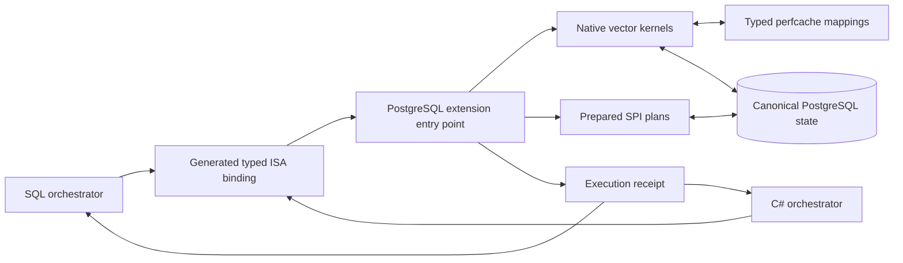
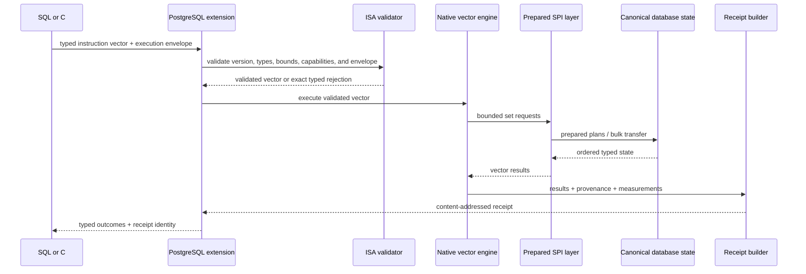
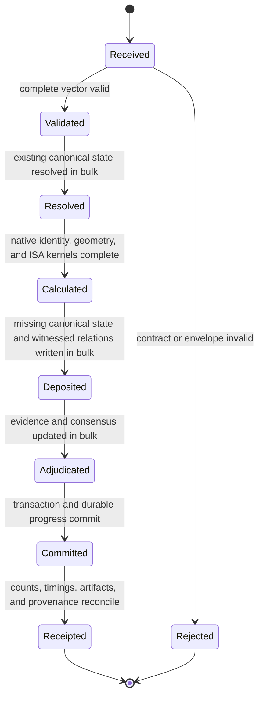
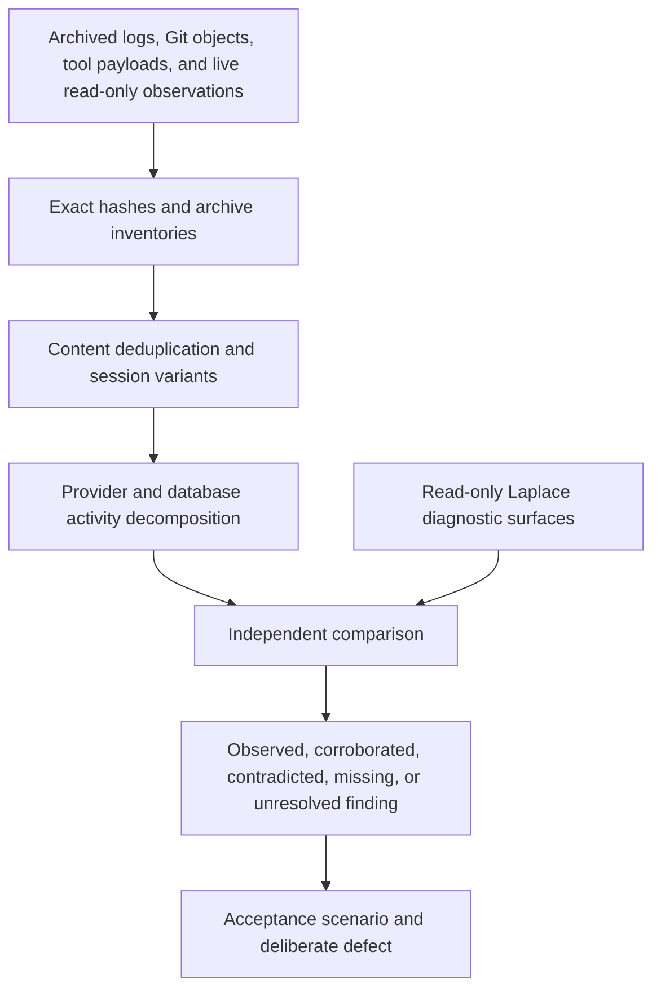

# PostgreSQL execution flow

Status: required architecture; implementation and complete acceptance remain open.

## Ownership

SQL and C# submit and receive typed programs. Neither contains identity, geometry,
relation, evidence, cognition, conversation, or model semantics. Generated bindings
derive from the ISA contract, so an instruction cannot exist for only one orchestrator.

## One vector execution

Validation precedes mutation. A rejected vector produces an exact rejection outcome
without partial state. One-element execution is the same sequence with vector length
one.

## Batch state machine

No state transition permits a client round trip per record. Resource-derived vector
partitioning can create several bounded internal chunks, but each chunk preserves the
same ordered semantics and the receipt accounts for all chunks.

## Troubleshooting and audit flow

Laplace may answer questions about its witnessed state, relations, ingest receipts, and
execution history. Those answers remain one evidence source. Raw event payloads, Git
identity, PostgreSQL counters, loaded binaries, and direct implementation tests provide
independent comparison so the system cannot establish correctness merely by describing
itself as correct.
